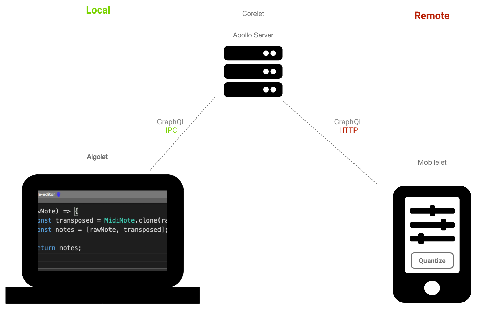
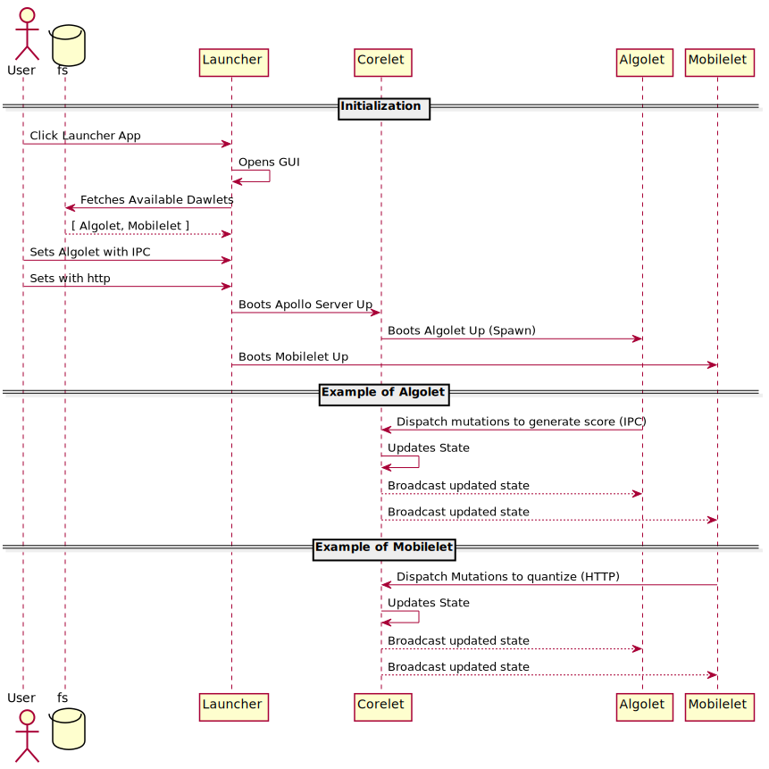

<!-- START doctoc generated TOC please keep comment here to allow auto update -->
<!-- DON'T EDIT THIS SECTION, INSTEAD RE-RUN doctoc TO UPDATE -->
**Table of Contents**  *generated with [DocToc](https://github.com/thlorenz/doctoc)*

- [Dawlet POC](#dawlet-poc)
  - [Concept Image](#concept-image)
  - [RoadMaps](#roadmaps)
  - [Ideas (In Japanese)](#ideas-in-japanese)
  - [Currently Planned Sequence](#currently-planned-sequence)
  - [Community](#community)
  - [Core API](#core-api)
  - [List of Dawlets](#list-of-dawlets)

<!-- END doctoc generated TOC please keep comment here to allow auto update -->

# Dawlet POC

## Concept Image

## RoadMaps

[Github Project](https://github.com/orgs/dawlet-team/projects/1)

## Ideas (In Japanese)

[miro](https://miro.com/app/board/o9J_ku1DEhQ=/)

## Currently Planned Sequence

## Community

Excited about Dawlet?  
Join Our Community on [Discord](https://discord.gg/H6YFDsd)!

## Core API

[GraphQL Schema](https://dawlet-schema.now.sh/)

## List of Dawlets

|           Name           |   Status    | Description                                                                                                  |
| :----------------------: | :---------: | :----------------------------------------------------------------------------------------------------------- |
| 🚀&#160;Algolet&#160;🚀  |   Limited   | Algolet lets you write your own custom logic to generate music.                                              |
| 🎼&#160;Sheetlet&#160;🎼 |   Limited   | Sheetlet displays the music represented as a sheetmusic.                                                     |
| 🎸&#160;Synthlet&#160;🎸 | **WIP** | Synthlet provides a simple synthesizer to playback the music. It has a dedicated local transport on its own. |
| 🎹&#160;Rolelet&#160;🎹  | COMING SOON | Rolelet is a DawletScore-compliant piano roll. It accepts an incoming midi to perform a realtime recording.  |
