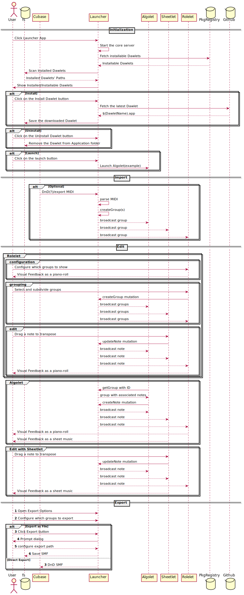

# Dawlet POC

/badge.svg>)

## Concept Image

## Currently Planned Sequence

## List of Dawlets

|           Name           |   Status    | Description                                                                                                  |
| :----------------------: | :---------: | :----------------------------------------------------------------------------------------------------------- |
| 🚀&#160;Algolet&#160;🚀  |   **WIP**   | Algolet lets you write your own custom logic to generate music.                                              |
| 🎼&#160;Sheetlet&#160;🎼 |   **WIP**   | Sheetlet displays the music represented as a sheetmusic.                                                     |
| 🎸&#160;Synthlet&#160;🎸 | COMING SOON | Synthlet provides a simple synthesizer to playback the music. It has a dedicated local transport on its own. |
| 🎹&#160;Rolelet&#160;🎹  | COMING SOON | Rolelet is a DawletScore-compliant piano roll. It accepts an incoming midi to perform a realtime recording.  |

## TODOs

- [ ] Core
  - [ ] Enable Switching Apollo Link
  - [ ] Enable Using IPC
- [ ] Launcher
  - [ ] Enable Configuring Dawlets (WIP)
  - [x] Add Launching Utils
- [ ] Algolet
  - [x] Setup Monaco Editor
  - [ ] split pane support
  - [ ] Add Simple API
- [ ] Midilet
  - [ ] Enable Midi Recording
  - [ ] Enable Preview
- [ ] Sheetlet
  - [ ] Standalone Capability
- [ ] Doc
  - [ ] Generate API Doc (or GraphQL Schema Doc)
